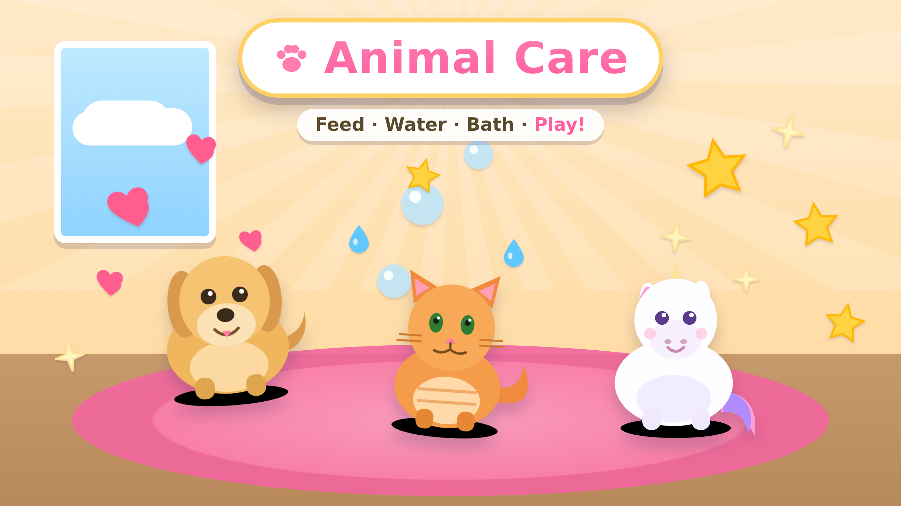

# Fun Game Hub 🎮

<p align="center">
  
</p>

A touch-friendly game hub for kids. The home screen is a menu of games:
- **Animal Care** — look after cartoony pets (a dog, a cat, a unicorn, and a
  bunny you hatch from an egg) by feeding, watering, bathing, brushing, playing,
  and tucking them in.
- **Letter Samurai** — a gentle "Fruit Ninja" with a learning twist: the game
  says a letter out loud and tosses letters up like fruit; swipe to slash the
  one you heard.
- **Climb & Spell** — a masked climber hero crawls and web-swings between letter
  perches; the game says "Crawl/Swing to C!" and reaching the right letters in
  order spells simple words.
- **Beat Buddies** — the three pets are a band (drum dog, piano cat, chime
  unicorn); tap each animal in time as beat bubbles reach it to play a song.
- **Counting Market** — a pet asks for a number of fruit ("3 apples!"); count
  them out into the basket and hand it over. Early counting and numbers.
- **Pet Pairs** — a memory game: flip paw-print cards two at a time to find
  matching pets. Clear the board to win and level up to a bigger grid. A **Names**
  mode swaps one card of each pair for the pet's name word, for early reading.
  No timer, no losing.
- **Shape Sorters** — a sorting/logic game: an item (a colored shape) appears;
  tap the bin it belongs in. The rule changes by level — sometimes sort by shape
  (ignore the color), sometimes by color (ignore the shape). No timer, no losing.
- **Word Builders** — a construction-themed spelling game: the word to build is
  always shown on a **blueprint sign**, and laid out below as **letter-shaped
  molds** carved into concrete. **Tap a letter and a gantry crane's claw grabs it
  and lowers it into its form**, or drag it there yourself (it settles in with a
  puff of dust). Longer words and decoy
  letters arrive as you level up. No timer, no losing.
- **Metal Makers** — a welding workshop: cut a shape out of a metal sheet with
  the torch, weld the pieces together, and rivet them tight to build a creation
  (star → rocket → robot → trophy). A goggled worker cheers you on, and finished
  builds go on your trophy shelf. No timer, no losing.

Built as a **zero-build static site**: plain HTML, CSS, and JavaScript (ES
modules) with hand-drawn inline SVG characters. No installs, no bundler, no
dependencies. It hosts anywhere static files can live (e.g. GitHub Pages).

## Play it

**Online:** https://jpmk12.github.io/Variety-game/ — open it on a tablet and,
for a full-screen app feel, use the browser's **Add to Home Screen**. (Published
via GitHub Pages set to **Deploy from a branch → `main`**; the site is the repo
root, and `.nojekyll` makes it serve files as-is.)

**Locally:** ES modules need to be served over HTTP (not opened as a `file://`),
so start any static server from the project root:

```bash
python3 -m http.server 8000
# then open http://localhost:8000 on a tablet or browser
```

## How Animal Care works

Animal Care is a little **three-view** world: the **room** of pets → a **zoomed
pet** → an interactive **mini-game** for each chore. Every task is now its own
hands-on game with a goal meter you fill to win.

- **Tap a pet to zoom in.** The pet fills the screen with its six **needs meters**
  (food, water, clean, tidy, happy, rest) and six **task buttons**. A "← Room"
  button takes you back to all the pets.
- **Each task is its own mini-game** with a **goal meter** — fill it to win, then
  a celebration plays, that need tops up to full, and you're back on the pet to
  pick the next chore. No timers and no way to lose — the meter fills purely by
  doing the activity, which suits young kids.
  - 🛁 **Bath** — *scrub* the dirt spots off by dragging over the pet (each one
    turns to suds), then *rinse* the bubbles away. The Clean meter fills as you
    scrub and rinse → squeaky-clean shine.
  - 🍖 **Feed** — **drag treats** (🍖🦴🍗🥩🍪) to the pet's mouth; it chews with a
    happy bounce and the Food meter fills.
  - 💧 **Water** — **hold to pour** water into the bowl; when it's full the pet
    laps it down and the Water meter fills.
  - 🪮 **Brush** — **stroke over the fur** to smooth the messy tufts and add
    shine; the Tidy meter fills as the knots clear.
  - 🎾 **Play** — **tap the bouncing ball** to rally it back and forth; each hit
    makes the pet hop and fills the Happy meter.
  - 🌙 **Night** — the room dims; **gently pat** the sleepy pet (tap) as 💤 float
    up, and the Rest meter fills until it drifts off to sleep.
- **Each animal has its own voice:** a woof for the dog, a meow for the cat, and
  a sparkly chime for the unicorn (played when it wins a mini-game).
- **See how each pet is doing:** in the room every pet has a mood face and pops
  up a **thought bubble** showing what it wants when a need runs low; zoom in to
  see all six meters at a glance.
- **Celebrations:** winning a mini-game bursts confetti and cheers, and the pet
  strikes a happy pose (chewing, hopping, sleeping…).
- **Reduced-motion aware:** honors the system "reduce motion" setting.
- Stats save to the browser (`localStorage`) and drift down slowly over real
  time, so pets are happy to see you again — but never neglected to misery.
- Use the 🔊 button in the top bar to mute/unmute sounds (sounds are generated
  with the Web Audio API — there are no audio files).

## How Letter Samurai works

- Tap **Start**, then listen: the game says "Slash the letter B!" (device
  text-to-speech) and shows the target letter in the corner.
- Letters are tossed up like fruit. **Swipe through the called letter** to slash
  it — it bursts with juice and sparkles, plays a ding, and your score goes up.
- Slashing the **wrong** letter just puffs away with a soft "oops" — no penalty,
  nothing ends. Tap the 🔊 chip to hear the letter again.
- **Settings** (on the start screen, or the ⚙️ button in-game): choose what to
  slash — **Letters / Numbers / Both / Words** — and the **Speed** (🐢 Slow /
  🚶 Medium / 🐇 Fast, which changes how long the glyphs float). Choices are saved.
- **Word Mode 🗡️:** the sensei calls a short word ("Spell CAT!") and you slash
  its letters **in order** as they fly by — each one locks into a word bar at the
  bottom. Spell the whole word for a cheer and bonus stars, then a new word
  comes. A gentle bridge from letters to reading.
- Rendered on a `<canvas>` with a DOM HUD; respects the same top-bar mute.

## How Climb & Spell works

- Tap **Start**. The game shows a word as blanks and tells you (on screen + out
  loud) **"Crawl to C!"** or **"Swing to C!"**.
- The reachable perches glow; near ones are a **crawl**, farther ones a **swing**
  (the hero shoots a web line and arcs over). Several are reachable at once, so
  there are multiple paths.
- Tap the perch with the called letter → the hero crawls/swings there and the
  letter drops into the word. Reaching the right letters in order **spells the
  word** (CAT, DOG, SUN…), then a celebration and a new word.
- Wrong perch? A soft "oops" and it re-says the letter — no penalty.
- **Three worlds, growing words 🌳🏙️🌙:** spell a few words in the **Backyard**
  (3-letter words) to open the **City Rooftops** (4 letters), then the **Night
  Sky** (5 letters). Each world has its own backdrop (sunny yard → dusk skyline →
  starry navy), a **"City Rooftops!"** banner when it opens, and a label showing
  how many words until the next one. Your world is saved between sessions.
- **Baddies:** now and then an original cartoon critter scuttles onto the wall —
  tap it to **web it up for +5** points (score shows 🕸️ top-left). They're our
  own designs (a goblin/octo/rhino bug), not based on any trademarked character.
- The hero is an **original** masked climber (our own colors + a star emblem),
  not based on any trademarked character.

## How Beat Buddies works

- Pick from **five songs** (each tagged 🐢 Easy / 🚶 Medium / 🐇 Fast by tempo)
  or **Free Jam**. After a "3 · 2 · 1 · Go!" count-in, **beat bubbles** float
  down each pet's lane toward a hit ring, and the band bobs along to the beat.
- **Tap each pet as its bubble reaches the ring** — the drum dog, piano cat, and
  chime unicorn each play their (synthesized) instrument, and repeated taps walk
  up a little scale so it sounds musical. Nail the timing for a "Perfect!" (the
  ring flashes); a combo counter tracks your streak.
- Finish the song for confetti, a band cheer, and a **star rating** (1–3 based on
  how many beats you hit — a perfect show pays bonus stars). Your **best rating
  per song is saved** and shown on the picker. Stickers: **First Gig /
  Showstopper / Rock Star**.
- **No fail state** — missed bubbles just drift away, and tapping a pet always
  makes a sound. **Free Jam** has no bubbles at all — a three-instrument toy for
  the littlest players. All sound is Web Audio synthesis; no audio files.

## How Counting Market works

- Tap **Open the Shop!** A pet comes to the stall and asks for some fruit — shown
  as a **numeral, counting dots, and the fruit**, and said out loud ("3 apples,
  please!").
- **Drag fruit from the bins into the basket** — each one is counted aloud (one…
  two… three…). Tap a fruit in the basket to take it back out. Then press
  **Give it!**: the right count makes the customer happy and pays a ⭐; a wrong
  count gets a gentle "count again!" (no fail).
- Serve a **whole day of customers** (5) to finish the day for confetti, stars,
  and a sticker — then the next day levels up.
- **Grows with the child:** Day 1 counts 1–5 of one fruit; Day 2 uses bigger
  numbers and adds a wrong-fruit bin to pick past; Day 3 gives **two-item**
  orders ("2 🍎 and 1 🍌"); **Day 4 introduces adding** — the order is a picture
  sum ("2 🍓 + 1 🍓 = ?") and you count out the **total**. Your day is saved.

## Letter Samurai belts

Slashing correctly builds a **karate belt rank** that grows over time (across
every session — it counts lifetime correct slashes):

- **White → Yellow → Orange → Green → Blue → Red → Black.** The start card shows
  your current belt with a progress bar to the next one ("10 more to Yellow
  belt"), and a rank chip sits by the score during play.
- Cross a threshold mid-game and a **"🥋 Orange Belt!"** banner pops up with
  spoken praise. It's pure encouragement — belts never make the game harder.

## Stars & the Sticker Book

Every game shares one reward economy so playing always earns something to keep:

- **⭐ Stars** — a single wallet shown at the top of the hub. Winning an Animal
  Care mini-game gives 3, spelling a word in Climb & Spell gives 3, each correct
  Letter Samurai slash gives 1 (plus 2 for webbing a baddie).
- **📖 Sticker Book** — open it from the hub to see every collectible. Earned
  stickers are bright and named; locked ones show a mystery card with a hint on
  how to unlock it (e.g. *"Finish a bath"*, *"Slash 10 correct"*, *"Spell 5
  words"*). Milestone stickers auto-unlock as the star total and lifetime
  counters climb.
- **❤️ Pet friendship** — in Animal Care each pet has a friendship level that
  grows as you play its mini-games; a win pops **"+3 ⭐"**, any level-up, and a
  **"New sticker!"** callout right in the celebration. Reaching friendship
  level 3 (and 5) unlocks its own sticker.
- **Hub progress** — each game card shows a 🏅 badge of how many of its stickers
  you've collected, so there's always a next one to chase.

All of this persists to `localStorage` and works offline; there's no way to lose
progress.

## Player profiles 👦👧

Siblings can share the app without stepping on each other's pets. Tap the
**profile chip** in the top-left of the hub to open **"Who's playing?"**, where
you can switch players or make a new one (up to three) with a name and an animal
avatar. Each profile keeps its **own** stars, stickers, pets, and everything
else — every save is namespaced by the active profile in `storage.js`. The first
profile uses the original un-prefixed keys, so anyone who was already playing is
folded into "Player 1" and keeps all of their progress.

## Hatch a new pet 🥚

After you've cared for your pets a few times, a **mystery egg** appears in the
room. **Tap it to keep it warm** — a little warmth meter fills, and when it's
full the egg cracks open and **Clover the bunny 🐰 hatches!** The bunny becomes a
full member of the family — its own friendship, all six care tasks, dress-up,
and Trick School — and it's saved, so it's waiting for you next time. Hatching
earns the **Egg Hatcher** sticker. Keep caring for your pets and a **second egg**
appears later — warm it to hatch **Ember the dragon 🐉** (the **Dragon Friend**
sticker), for five pets in all.

**A living room.** The room follows the **real time of day** — sunny mornings, a
bright afternoon, an orange **dusk**, and a **night** sky with a moon and stars
in the window. And with **🏡 Decorate** you can spend stars on decorations
(a plant, balloons, a pet bed, a lantern…) and place them around the room; your
choices are saved (and unlock the **Decorator** sticker).

## Dress-Up Shop

Stars now have a purpose — spend them to dress up your pets:

- Open **🛍️ Shop** from a zoomed pet to browse **9 accessories** (bow, ball cap,
  top hat, flower, crown, shades, scarf, medal, ribbon) in three slots (hat,
  face, neck — one worn per slot at a time).
- **Buy** an item once with stars; it's then owned forever and auto-worn.
  **Wear / Take off** toggles it on the current pet.
- Accessories are worn **everywhere** — the room, the zoomed detail, and inside
  every mini-game — and each pet has its own outfit that persists between
  sessions. Buying your first item unlocks the **Fashionista** sticker.

## Trick School

Teach your pet tricks it will remember and show off:

- Open **🎓 Tricks** from a zoomed pet. The teacher names a trick and the pet
  demos it while the matching button (**Sit / Spin / Jump / Shake**) glows — tap
  it and the pet performs. Five good reps graduates the pet (fills the meter,
  earns stars + friendship, unlocks the **Star Pupil** sticker).
- Once graduated, **tap the pet** on its screen and it performs a random learned
  trick with a little animation and a shout-out ("Spin! 🌀"). Learned tricks
  persist per pet between sessions.

## Mini-game levels

The six care games **grow with the child**. Each game has a level (1–3) that
goes up a notch every time you win it (shown as a **"Lv N"** badge, and saved):

- **More to do:** Bath adds dirt (7 → 9 → 11), Brush adds tangles (6 → 8 → 10),
  Bedtime needs more pats (8 → 10 → 12), Play is a longer rally (6 → 8 → 10).
- **New twists:** Water pours slower so it takes a steadier hold; Play's ball
  gets small and zippy at level 3; and **Feed** mixes in *yucky* foods
  (🥦🧅🌶️) the pet shakes its head at — the child has to pick the good treats.

Nothing here can be failed — the meter still just fills as you play.

## Project layout

```
index.html              app entry; loads js/main.js as a module
css/
  styles.css            theme, hub menu, room, action bar
  animations.css        idle + action keyframes
js/
  main.js               app shell + router (hub <-> game) + top-bar buttons
  hub.js                renders the menu (star wallet + sticker progress) from the registry
  registry.js           list of games (add new games here)
  storage.js            localStorage helpers
  progress.js           shared reward store: stars, pet friendship, stickers
  stickers.js           the sticker catalog (all games) + unlock rules
  stickerbook.js        the collection screen reached from the hub
  audio.js              Web Audio sound effects + mute
  games/animal-care/
    index.js            router across room / zoomed pet / mini-game / shop views
    animals.js          dog / cat / unicorn SVG characters
    actions.js          feed / water / bath / play definitions + praise copy
    stats.js            stat model, needs metadata, time decay, mood mapping
    accessories.js      dress-up catalog (emoji, slot, cost, on-pet position)
    wardrobe.js         decoratePet(): renders equipped accessories on a pet
    minigames/
      index.js          maps an action id to its mini-game module
      shell.js          shared mini-game shell: goal meter + pet stage + win
      bath.js           scrub the dirt off, then rinse the suds
      feed.js           drag treats to the pet's mouth
      water.js          hold to pour the bowl full
      brush.js          stroke over the fur to smooth the tufts
      play.js           tap the ball to rally a happy pet
      night.js          dim the room and pat the pet to sleep
      tricks.js         Trick School: teach sit / spin / jump / shake
  games/samurai/
    index.js            canvas game: physics, slicing, waves, HUD
    content.js          letter pool + colors + wave builder
    belts.js            karate-belt ranks (by lifetime correct slashes)
    speech.js           Web Speech API wrapper (says the target letter)
  games/climb-spell/
    index.js            wall scene, perch reachability, crawl/swing, worlds
    hero.js             original masked-climber SVG
    words.js            three worlds of words (3/4/5 letters) + distractors
  games/beat-buddies/
    index.js            3-lane rhythm engine: beat clock, bubbles, hits, win
    songs.js            band instruments + data-driven songs
  games/counting-market/
    index.js            stall, customer orders, basket drag/count, day loop
    orders.js           fruit catalog + per-level order generation
assets/
  favicon.svg, icon-*.png     app icons (tab + home screen)
  animal-care-thumbnail.png   README hero image
scripts/
  hero.html             generates the thumbnail (reuses the real animal art)
```

## Adding another game later

Add an entry to `js/registry.js` with an `id`, `title`, `emoji`, and a
`mount(el)` function that renders into the given element and returns an optional
`unmount()` cleanup. The hub menu picks it up automatically.

## Regenerating the thumbnail

The hero image is a screenshot of `scripts/hero.html` (which reuses the real
pet art). With the dev server running, render it with any headless browser, e.g.
Playwright, capturing the `#hero` element into `assets/animal-care-thumbnail.png`.
